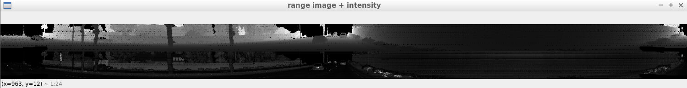
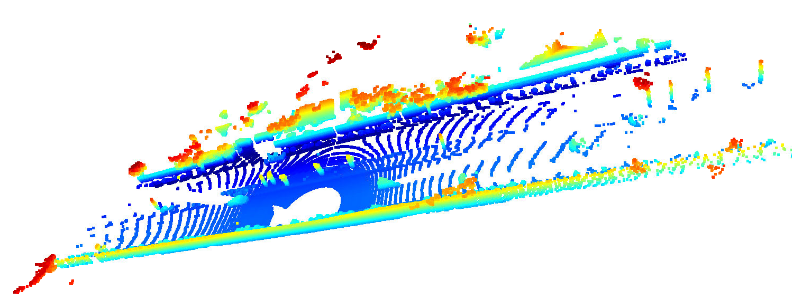
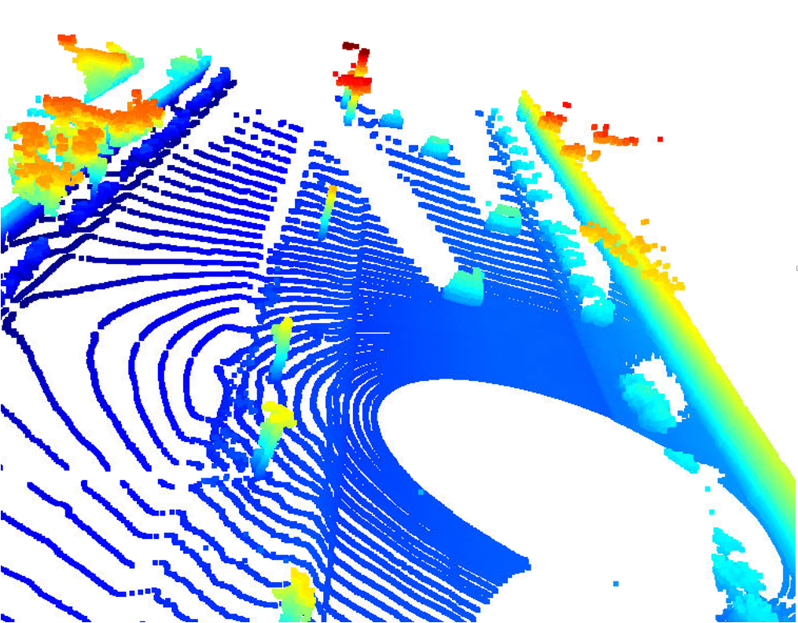
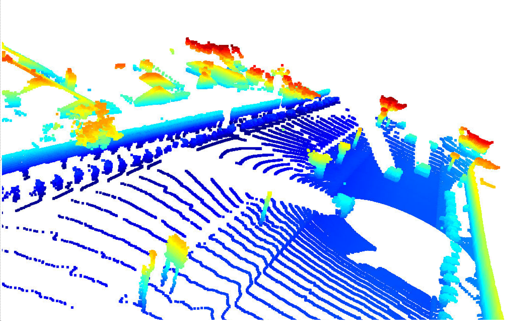
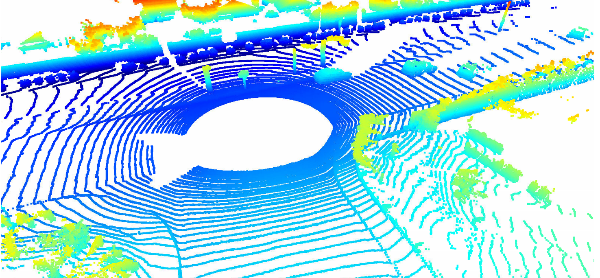
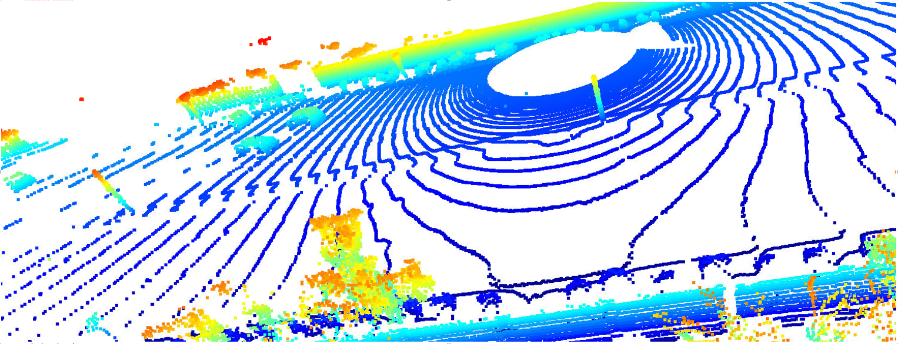
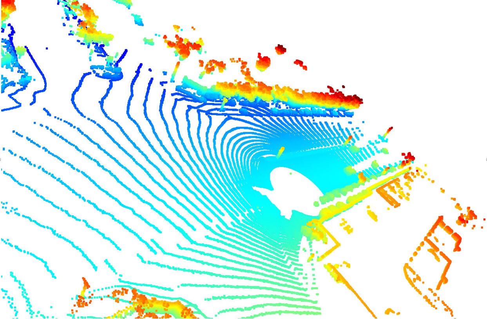

# Mid-Term-Project-3D-Object-Detection
This project has several task to be performed, divided as follow:
* Step 1
* Step 2
* Step 3
* step 4

## Step 1
The aim of this step is to extract Lidar data from the image, both range image and intensity channels, stack them together and eventually compute the Lidar point-cloud using Open3D library (source code is in [objdet_pcl.py](objdet_pcl.py)).
 
The results of the steps are the following:

In the following images are shown some example of point cloud; I've taken some screenshots on different scenarios (straight line, T-junction, X-junction) where it's possible to identify front and rear bumpers of the following and upcoming vehicles respectively, pedestrians, road poles, walls. In the screenshots shape and vehicle's direction are easy to determine, tail lights aren't visible nor interfere with Lidar return signal, probably measurements were taken in day-light condition.
 *Bumpers of preceeding and following vehicles* 
 *Tails of preceeding vehicles*
 *Tails of preceeding vehicles and pedestrians on the left*
 *Preceeding vehicles in a T-junction*
 *Preceeding vehicles, walls and trees on the road side*
 *Preceeding vehicles in a X-junction*

## Step 2
