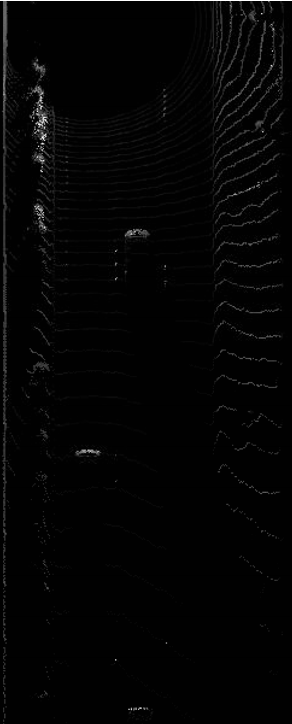
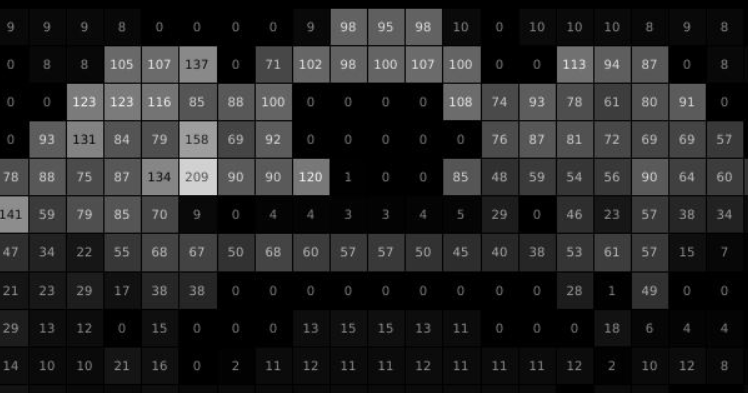

# Mid-Term-Project-3D-Object-Detection
This project has several task to be performed, divided as follow:
* Step 1
* Step 2
* Step 3
* step 4

## Step 1
The aim of this step is to extract Lidar data from the image, both range image and intensity channels, stack them together and eventually compute the Lidar point-cloud using Open3D library (source code is in [objdet_pcl.py](objdet_pcl.py)).
<br>
The results of the steps are the following:

In the following images are shown some example of point cloud; I've taken some screenshots on different scenarios (straight line, T-junction, X-junction) where it's possible to identify front and rear bumpers of the following and upcoming vehicles respectively, pedestrians, road poles, walls. In the screenshots shape and vehicle's direction are easy to determine, tail lights aren't visible nor interfere with Lidar return signal, probably measurements were taken in day-light condition.

 *Bumpers of preceeding and following vehicles* 
 *Tails of preceeding vehicles*
 *Tails of preceeding vehicles and pedestrians on the left*
 *Preceeding vehicles in a T-junction*
 *Preceeding vehicles, walls and trees on the road side*
 *Preceeding vehicles in a X-junction*

## Step 2
The aim of this step is to extract to create Bird's Eye View image from point-cloud data and then compute intensity and height lchannels of the BEV map.

### BEV map
Coordinates from the sensor space have been converted to BEV coordinates.
 *BEV map*

### Intensity channel
Here is the plot of the intensity channel with "raw" values (no modification on the insensity value); the contrast in this picture isn't high, so I've tried to change point distribution to increase it.

  

Intensity distribution points were concentrated between 0.01 and 0.1:

```
b = np.array([0, 1e-5, 1e-4, 1e-3, 1e-2, 1e-1, 1, 1e+1, 1e+3, 1e+3, 1e+4, 1e+5, 1e+6, 1e+7])
hist,bins = np.histogram(lidar_pcl_cpy[:,3], bins=b)
print(hist)
```

 *Intensity points distribution*

In order to achieve an higher contrast in the intensity layers I've applied the following correction to the raw values; the idea is to "lower" the points with higher intensity to the mean value and, doing so, increase the contrast.

```
lidar_pcl_cpy[lidar_pcl_cpy[:, 3] > 0.1, 3] = 0.01
```

The result after the correction is the following:


### Height channel
Resulting height channel picture has good contrast, no modification have been applies to the raw values.


## Step 3
The aim of this step is to set configuration for the resnet model, run the model on a couple of frames and evaluate the output.
I've used the following configuration for the resnet model:

```
inserire config
```

At this point, the detection arrays (on 2 sample frames) look like this:

 *Detection arrays*

In order to visualize the bounding boxes on the pitcure (only for vehicle class), BEV coordinates has to be converted into metric coordinates. The result of the operation is shown in the next pictures.


